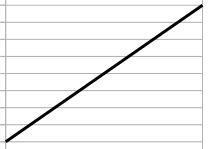
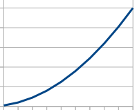
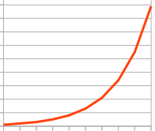
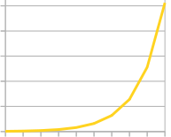
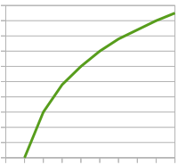

# Workloads

If you are using (k6)[https://k6.io/] for your load testing, you will
want some pre-defined load *curves*.

The following are curves that are progressively steep, meaning the
ramp to the desired load steeper. Another way to say this is that
the curves can be considered *spikier*:

*  Naturals
*  Naturals Squared
*  Fibonnaci
*  Exponential (2**N)

The following curves put the greater load early and then ramp
slower to the desired load:

*  Log

## Installation

In your `mix.exs` file:

```elixir
def deps do
  [
    {:workloads, github: "czrpb/workloads", sparse: "workloads"}
  ]
end
```

Via `Mix.install`:

```elixir
Mix.install([
  {:workloads, github: "czrpb/workloads", sparse: "workloads"}
])